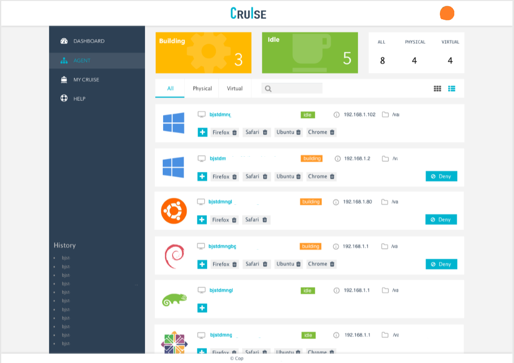

# tell-you-write-manage-page

教你如何写一个后端管理页面

## 1、确定页面内容

## 2、环境准备

* 脚手架：webpack3；
* 前端框架：React；
* css预处理器：less、postcss；
* 其他：babel、eslint、file-loader、style-loader、css-loader、uglifyjs-webpack-plugin、url-loader；

采用我自己之前配好的脚手架，见github链接：https://github.com/qq20004604/react-with-webpack

可以直接fork该脚手架，然后在该脚手架基础上进行开发；

## 3、第一次页面区块划分

前注解释：

* div#box，表示 \
\

* div.content-box，表示 \
\

原图分为三块：

* header：Crulse和头像所在的那个部分；
* content：中间的左边栏和右边主要内容区域；
* footer：下方的copyright；

思路如下：

1. 整体被 div#app 所包含，撑满 100% 的页面区域，position设置为relative；
2. div#app 下包含 div#header，div#content，div#footer 三部分，三部分的position都设置为 absolute；
3. div#header 设置为 top：0，left：0，with：100%，height设置为实际高度；
4. div#footer 思路同样，bottom：0，left：0，with：100%，height设置为实际高度；
5. div#content的top和bottom设置为header和footer的height，left和right设置为0；

然后，div#content再划分为两块，具体思路如下：

1. div#content下包含 div.content-box，宽度设置为定宽。而 div#content 的 overflow-x 属性设置为auto，目的是当中间过窄时，出现滚动条；
2. div.content-box 下含 div.aside和div.article。具体需要注意的情况，等下一次页面模块划分时再进行分析；

